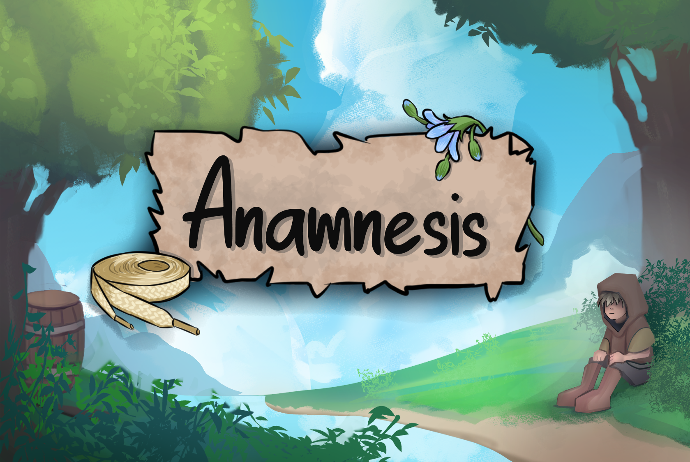

# Anamnesis

## Info:

In this isometric point-and-click puzzle game, you control an unnamed and silent protagonist who is accompanied by a disembodied narrator. 

The protagonist has traveled to a remote cabin to tend to the land in the absence of its owner who is a dear friend. They are given different tasks to complete to maintain the land to the standard their friend usually keeps it at. These tasks require you to find different items scattered through the land. 

As you complete these tasks and explore the beautiful area you will get to experience the memories our protagonist has of their friend. 

## Instructions:

To interact with items, objects, menu, and dialogue: Left Mouse Button

To move: Point and click with the left mouse button.

To use items in your inventory: Drag and drop them into the world with the left mouse button

Have fun, fill up your watering can and make sure to put your shoes on!

## Credits:

**Adele Fairchild** - 2D Environment Artist, 2D Character Artist

**Anniemay Parker** - Narrative Designer, Writer, Concept Artist, Project Manager

**Chris Collins** - Programmer, Technical Artist

**Mark Tan** - 2D UI Artist

**Michael Barbagallo** - Sound Designer

**Olin Gao** - Programmer

**Sarah Baradhi** - Composer

**Robyn Barry-Cotter** - Protagonist Voice Actor

**Brendan Barry-Cotter** - Narrator Voice Actor
